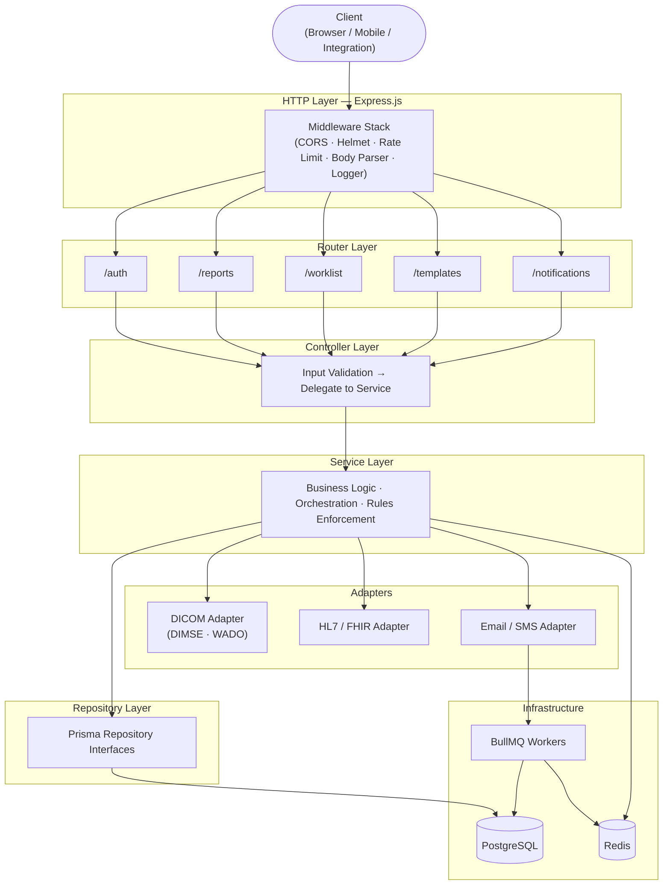
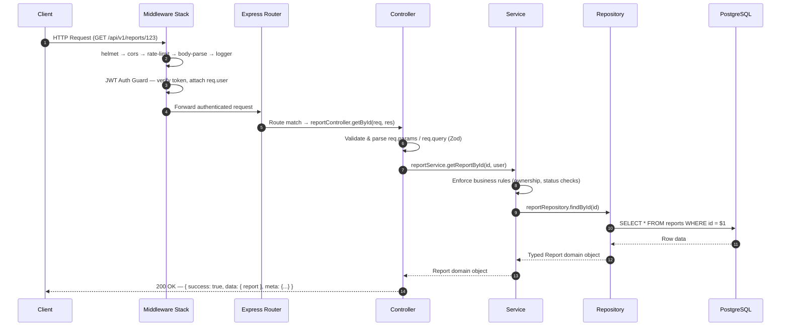

Understanding how the Mosaic Reporting backend is layered helps you navigate the codebase, debug issues faster, and reason about where new functionality belongs. The backend is organized into discrete horizontal layers — each with a clearly scoped responsibility — that a request passes through from the moment it arrives at the server to the moment a response is sent back.

## Architecture Layers

The backend follows a strict layered architecture. Each layer only communicates with the layer directly below it, keeping dependencies unidirectional and testable.

### Layer Descriptions

<Tabs>
  <Tab title="HTTP Layer">
    The **HTTP Layer** is the entry point for every inbound request. Express.js mounts a chain of middleware that executes in order before any route handler is invoked. This layer handles cross-cutting concerns — security headers, CORS policy, rate limiting, request body parsing, and structured request logging — so that none of these concerns leak into your route or business logic code.
  </Tab>
  <Tab title="Router Layer">
    The **Router Layer** maps URL prefixes to the correct module. Each of the five core modules registers its own Express router under `/api/v1/`:

    - `/auth` → Auth module router
    - `/reports` → Report module router
    - `/worklist` → Worklist module router
    - `/templates` → Template module router
    - `/notifications` → Notification module router

    Routers own only path-to-handler mappings and any route-level middleware (such as the JWT authentication guard or role-based access checks).
  </Tab>
  <Tab title="Controller Layer">
    **Controllers** are intentionally thin. When a router forwards a request to a controller, the controller is responsible for two things only: validating and parsing the incoming input (using a schema validator such as Zod), and then calling the appropriate service method with clean, typed arguments. Controllers never contain business logic or database queries.
  </Tab>
  <Tab title="Service Layer">
    The **Service Layer** is where all business logic lives. Services orchestrate calls to one or more repositories, enforce domain rules (e.g., a report cannot be finalized without an assigned radiologist), and invoke external adapters when cross-system actions are required. Services are the correct place to add new feature logic.
  </Tab>
  <Tab title="Repository Layer">
    **Repositories** abstract all database access behind a consistent interface. Every repository is implemented using Prisma and returns typed domain objects. Controllers and adapters must never query the database directly — all data access flows through a repository.
  </Tab>
  <Tab title="Adapters">
    **Adapters** translate between the Mosaic domain model and external system protocols:

    - The **DICOM Adapter** performs DIMSE operations (C-FIND, C-MOVE, C-STORE) and WADO-RS image retrieval against your PACS.
    - The **HL7/FHIR Adapter** processes inbound HL7 v2 ADT/ORM messages and emits outbound FHIR R4 DiagnosticReport resources to your EMR/RIS.
    - The **Email/SMS Adapter** dispatches notification payloads to external delivery providers and enqueues retries via BullMQ.
  </Tab>
  <Tab title="Infrastructure">
    The infrastructure tier consists of three components:

    - **PostgreSQL** — the primary relational store for all persistent data.
    - **Redis** — used for JWT refresh token storage, response caching, and as the backing store for BullMQ queues.
    - **BullMQ Workers** — long-running worker processes that consume jobs from Redis queues to perform async tasks such as sending notifications, fetching DICOM studies, and rendering report PDFs.
  </Tab>
</Tabs>

---

## Middleware Stack

The following middleware executes on every inbound request, in the order listed.

| Order | Middleware | Purpose |
|---|---|---|
| 1 | `helmet` | Sets secure HTTP response headers (CSP, HSTS, X-Frame-Options, etc.) |
| 2 | `cors` | Enforces the allowed-origins policy; rejects cross-origin requests from unlisted domains |
| 3 | `express-rate-limit` | Applies per-IP request rate limits to protect against abuse and brute-force attacks |
| 4 | `express.json` / `express.urlencoded` | Parses JSON and URL-encoded request bodies into `req.body` |
| 5 | Request Logger | Emits a structured log entry (method, path, request ID, user agent) for every request |
| 6 | JWT Auth Guard *(route-level)* | Verifies the `Authorization: Bearer <token>` header; attaches the decoded user to `req.user` |
| 7 | Role Guard *(route-level)* | Checks that `req.user` holds the required role for the requested resource |

<Note>
  The JWT Auth Guard and Role Guard are applied at the **router level**, not globally — public endpoints such as `POST /api/v1/auth/login` are explicitly excluded from these guards.
</Note>

---

## Request Lifecycle

The diagram below traces the full path of a typical authenticated request — for example, `GET /api/v1/reports/:id` — from the client through every layer to the database and back.

### Step-by-Step Walkthrough

<Steps>
  <Step title="Client sends the HTTP request">
    Your client (browser, mobile app, or an integration script) issues an HTTP request with an `Authorization: Bearer <token>` header. The request arrives at the Express.js server and enters the middleware chain.
  </Step>
  <Step title="Middleware chain executes">
    Each middleware in the stack runs in order. `helmet` sets security headers, `cors` validates the origin, `express-rate-limit` checks the request count for the client's IP, and `express.json` parses the request body. The request logger emits a structured log entry.
  </Step>
  <Step title="JWT Auth Guard validates the token">
    The JWT Auth Guard middleware extracts the bearer token, verifies its signature and expiry, and checks the Redis store for a matching refresh token. On success, it attaches the decoded user payload to `req.user` and passes the request to the router. On failure, it returns `401 Unauthorized` immediately.
  </Step>
  <Step title="Router matches the path">
    The Express router for the `reports` module matches the incoming path and method. If a Role Guard is registered on the route, it checks that `req.user.role` is permitted to access the endpoint. The router then invokes the appropriate controller handler.
  </Step>
  <Step title="Controller validates input and delegates">
    The controller parses and validates path parameters, query strings, and/or the request body using a Zod schema. If validation fails, it returns `400 Bad Request` with a structured error. If validation passes, it calls the relevant service method with typed arguments.
  </Step>
  <Step title="Service applies business logic">
    The service method enforces domain rules — for example, checking that the requesting user has access to the requested report — before proceeding. It then calls the appropriate repository method to retrieve or mutate data.
  </Step>
  <Step title="Repository queries the database">
    The Prisma-based repository translates the service call into a type-safe SQL query against PostgreSQL. It returns a typed domain object to the service.
  </Step>
  <Step title="Response flows back to the client">
    The domain object travels back up through service → controller. The controller wraps it in the standard JSON envelope `{ success, data, error, meta }` and sends the HTTP response to the client.
  </Step>
</Steps>

---

## Background Jobs

Not all work happens within the request lifecycle. Several operations are too slow or too volatile to run synchronously. BullMQ workers consume jobs from Redis-backed queues to handle these tasks asynchronously.

| Queue | Trigger | Worker Action |
|---|---|---|
| `notifications` | Report state change, assignment event | Dispatch email/SMS/in-app notification via the notification adapter |
| `dicom-fetch` | Study added to worklist | C-MOVE from PACS → store images; update study status in PostgreSQL |
| `pdf-generation` | Report finalized | Render report to PDF; store file reference; notify requesting user |

<Warning>
  BullMQ workers run as separate Node.js processes. If a worker process crashes, Redis retains the job in the queue and will re-deliver it on the next worker startup, up to the configured retry limit. Monitor the `failed` queue partition in your Redis dashboard to catch persistent job failures.
</Warning>
