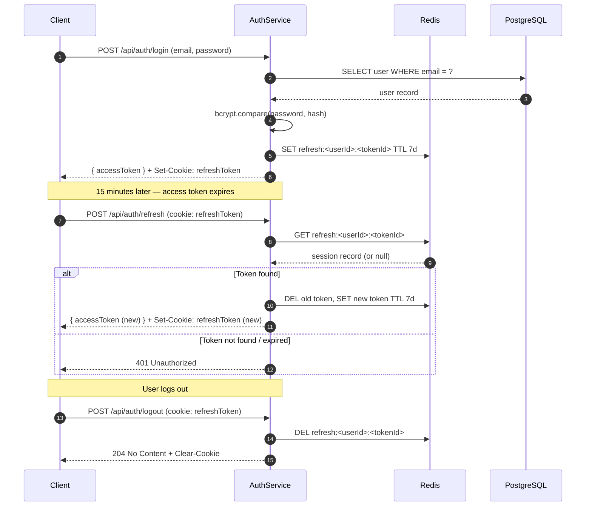

The auth service is the central identity layer for Mosaic Reporting. It manages user authentication, issues and validates JWT tokens, persists refresh sessions, and enforces role-based access control (RBAC) across every protected backend route. All other services defer authorization decisions to the guards this service exposes.

## Token Architecture

Mosaic Reporting uses a dual-token scheme: a short-lived **access token** and a long-lived **refresh token**.

| Token | Lifetime | Storage (client) | Algorithm | Key contents |
|---|---|---|---|---|
| Access token | 15 minutes | Memory / `Authorization` header | HS256 | `userId`, `email`, `role`, `iat`, `exp` |
| Refresh token | 7 days | HttpOnly cookie | opaque UUID | Pointer to Redis session record |

The access token payload is deliberately minimal. Sensitive attributes such as password hash or PII beyond `email` are never embedded in the token.

Refresh tokens are persisted in Redis under the key `refresh:<userId>:<tokenId>`. Storing them server-side allows individual sessions to be revoked immediately — the token is deleted from Redis and subsequent refresh attempts are rejected with `401 Unauthorized`.

## Endpoints

| Method | Path | Description |
|---|---|---|
| POST | `/api/auth/login` | Validate credentials, issue token pair |
| POST | `/api/auth/logout` | Revoke current refresh token |
| POST | `/api/auth/refresh` | Exchange a valid refresh token for a new access token |
| GET | `/api/auth/me` | Return the authenticated user's profile |

## Login Flow

<Steps>
  <Step title="Submit credentials">
    Your client sends a `POST /api/auth/login` request with a JSON body containing `email` and `password`.

    ```json
    {
      "email": "radiologist@hospital.org",
      "password": "s3cur3P@ssword!"
    }
    ```
  </Step>
  <Step title="Credential validation">
    The service fetches the user record by `email`. It then compares the submitted password against the stored bcrypt hash (cost factor **12**) using `bcrypt.compare()`. If either the user is not found or the password comparison fails, a generic `401 Unauthorized` is returned — no information is disclosed about which field was incorrect.
  </Step>
  <Step title="Token issuance">
    On success, the service signs a new HS256 access token containing the user's `userId`, `email`, and `role`. A cryptographically random refresh token UUID is generated, stored in Redis with a 7-day TTL, and set on the response as an `HttpOnly; Secure; SameSite=Strict` cookie.

    ```json
    {
      "accessToken": "<jwt>",
      "user": {
        "id": "usr_01HX...",
        "email": "radiologist@hospital.org",
        "role": "radiologist"
      }
    }
    ```
  </Step>
  <Step title="Subsequent requests">
    Your client attaches the access token to every API request via the `Authorization: Bearer <token>` header. Protected routes validate the token signature and expiry before allowing the request to proceed.
  </Step>
  <Step title="Token refresh">
    When the access token expires, your client calls `POST /api/auth/refresh`. The service reads the refresh token from the HttpOnly cookie, looks it up in Redis, and — if valid — issues a fresh access token and rotates the refresh token (old token deleted, new one written).
  </Step>
</Steps>

## Token Refresh & Revocation Sequence



## Role-Based Access Control

Every authenticated request carries a `role` claim inside the access token. The auth service exposes a `requireRole(...roles)` middleware that any route can compose:

```typescript
// Example usage in the report router
router.post(
  '/api/reports/:id/finalize',
  authenticate,                          // validates JWT
  requireRole('radiologist', 'admin'),   // enforces RBAC
  finalizeReportHandler
);
```

The four roles and their default permissions are:

| Role | Read reports | Create/edit reports | Finalize reports | Manage templates | Manage users |
|---|---|---|---|---|---|
| `admin` | ✅ | ✅ | ✅ | ✅ | ✅ |
| `radiologist` | ✅ | ✅ | ✅ | ❌ | ❌ |
| `resident` | ✅ | ✅ | ❌ | ❌ | ❌ |
| `technologist` | ✅ (own studies) | ❌ | ❌ | ❌ | ❌ |

<Note>
  Permission checks are enforced at the **service layer**, not just at the route level. Even if a request bypasses route-level middleware (e.g., during internal service-to-service calls), the service guards will still reject unauthorized operations.
</Note>

## Password Hashing

Passwords are hashed with **bcrypt** at a cost factor of **12** before storage. You should never store or log plaintext passwords at any point in the pipeline. On user creation or password reset, the service calls:

```typescript
const hash = await bcrypt.hash(plaintext, 12);
```

The cost factor is configurable via the `AUTH_BCRYPT_ROUNDS` environment variable. Increasing it above 12 will slow down hashing on high-traffic instances; do not reduce it below 10 in production.

## Environment Variables

| Variable | Description | Example |
|---|---|---|
| `JWT_SECRET` | HMAC secret for signing access tokens | *(set via secrets manager — never hardcode)* |
| `JWT_EXPIRES_IN` | Access token lifetime | `15m` |
| `REFRESH_TOKEN_TTL_SECONDS` | Refresh token TTL in Redis | `604800` |
| `AUTH_BCRYPT_ROUNDS` | bcrypt cost factor | `12` |
| `REDIS_URL` | Redis connection string | `redis://localhost:6379` |
