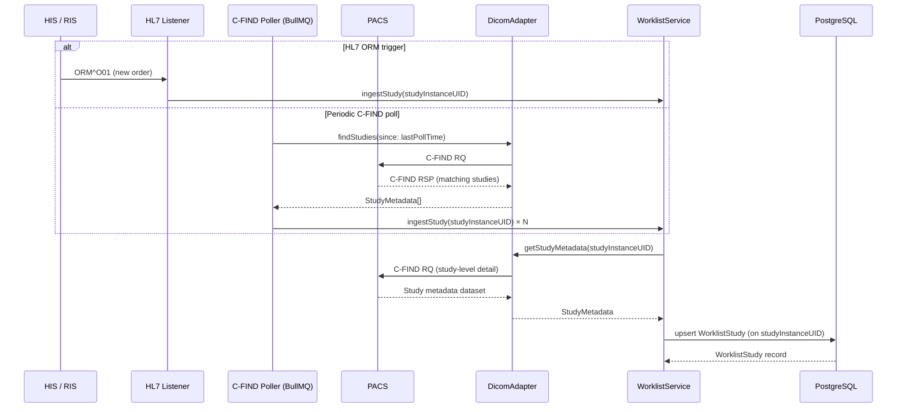

Mosaic Reporting integrates with Picture Archiving and Communication Systems (PACS) using standard DICOM protocols. Incoming studies are discovered via DIMSE C-FIND queries or HL7 ORM notifications, ingested into the worklist, and then made available to the frontend DICOM viewer through a WADO-RS proxy. All DICOM communication happens within your internal network — no DICOM traffic is exposed to the public internet.

<Warning>
  DICOM communication uses your internal network. The PACS must be reachable from the backend container by hostname and port. Verify network policies and firewall rules before deploying. If the PACS is unreachable, study ingestion will fail silently unless you monitor the `DicomAdapter` error logs.
</Warning>

---

## DICOM Protocols Used

Mosaic Reporting uses two distinct DICOM communication patterns:

| Protocol | Direction | Purpose |
|---|---|---|
| **DIMSE C-FIND** | Backend → PACS | Query the PACS for new or updated studies matching configured criteria |
| **DIMSE C-MOVE / C-GET** | Backend ↔ PACS | Optionally retrieve DICOM instances to the backend for processing |
| **WADO-RS (DICOMweb)** | Frontend → Backend → PACS | Retrieve series and instance image data for the viewer |

---

## DicomAdapter Class

The `DicomAdapter` class encapsulates all DICOM communication. It wraps the `dcmjs` and `dicom-dimse` libraries and exposes a clean async interface consumed by the worklist service and the WADO-RS proxy.

**Key methods:**

| Method | Description |
|---|---|
| `findStudies(queryParams)` | Executes a C-FIND query against the PACS and returns matching study metadata objects |
| `getStudyMetadata(studyInstanceUID)` | Retrieves detailed metadata for a specific study, including series and instance counts |
| `retrieveInstances(studyInstanceUID, seriesUID)` | Fetches DICOM instances for a given series (used by the WADO-RS proxy) |

```typescript
// src/dicom/dicom.adapter.ts (simplified)
import { DicomMessage } from 'dcmjs';
import { DIMSE } from 'dicom-dimse';

export class DicomAdapter {
  private readonly aet: string;
  private readonly pacsAet: string;
  private readonly pacsHost: string;
  private readonly pacsPort: number;

  constructor() {
    this.aet       = process.env.DICOM_CALLING_AET!;
    this.pacsAet   = process.env.DICOM_PACS_AET!;
    this.pacsHost  = process.env.DICOM_PACS_HOST!;
    this.pacsPort  = parseInt(process.env.DICOM_PACS_PORT!, 10);
  }

  async findStudies(queryParams: StudyQueryParams): Promise<StudyMetadata[]> {
    // Build C-FIND RQ dataset and execute against PACS
    const results = await DIMSE.cfind({
      callingAET: this.aet,
      calledAET:  this.pacsAet,
      host:       this.pacsHost,
      port:       this.pacsPort,
      dataset:    this.buildCFindDataset(queryParams),
    });
    return results.map(this.mapToStudyMetadata);
  }

  async getStudyMetadata(studyInstanceUID: string): Promise<StudyMetadata> { /* ... */ }
  async retrieveInstances(studyInstanceUID: string, seriesUID: string): Promise<Buffer[]> { /* ... */ }
}
```

---

## DICOM Configuration Parameters

Configure DICOM connectivity via environment variables in your `.env` file or container environment.

| Environment Variable | Description | Example |
|---|---|---|
| `DICOM_PACS_AET` | AE title of the target PACS | `PACS_AET` |
| `DICOM_PACS_HOST` | Hostname or IP of the PACS | `pacs.internal` |
| `DICOM_PACS_PORT` | Port the PACS listens on for DIMSE | `4242` |
| `DICOM_CALLING_AET` | AE title that Mosaic presents to the PACS | `MOSAIC_SCU` |
| `DICOM_WADO_BASE_URL` | Base URL of the PACS WADO-RS endpoint | `http://pacs.internal:8080/wado/rs` |
| `DICOM_CFIND_INTERVAL_SECONDS` | How often the background poller runs C-FIND | `60` |

---

## Study Ingestion Flow

Studies enter the Mosaic worklist through two entry points:

1. **HL7 ORM message** — the HIS/RIS sends an HL7 v2 ORM^O01 (order) message to Mosaic when a new study is ordered. The HL7 listener triggers the ingestion pipeline immediately.
2. **Periodic C-FIND poll** — a BullMQ recurring job runs every `DICOM_CFIND_INTERVAL_SECONDS` seconds, querying the PACS for studies that do not yet exist in the worklist.

Both paths converge on the `WorklistService.ingestStudy()` method, which is idempotent on `studyInstanceUID`.



---

## WADO-RS Proxy

The Mosaic backend proxies all WADO-RS requests from the frontend DICOM viewer to the PACS. This design:

- Keeps PACS credentials and network location hidden from the browser
- Enforces authentication — unauthenticated users cannot retrieve images
- Adds an audit log entry for every image retrieval request

The proxy is mounted at `/api/v1/wado` and forwards the path and query string to `DICOM_WADO_BASE_URL`. The frontend viewer is configured to point its WADO-RS base URL to the Mosaic backend proxy, not directly to the PACS.

```text
Frontend viewer
  → GET https://api.mosaic.internal/api/v1/wado/studies/{uid}/series/{suid}/instances
  → Backend authenticates request, logs access
  → Proxies to http://pacs.internal:8080/wado/rs/studies/{uid}/series/{suid}/instances
  → Returns image data to frontend
```
