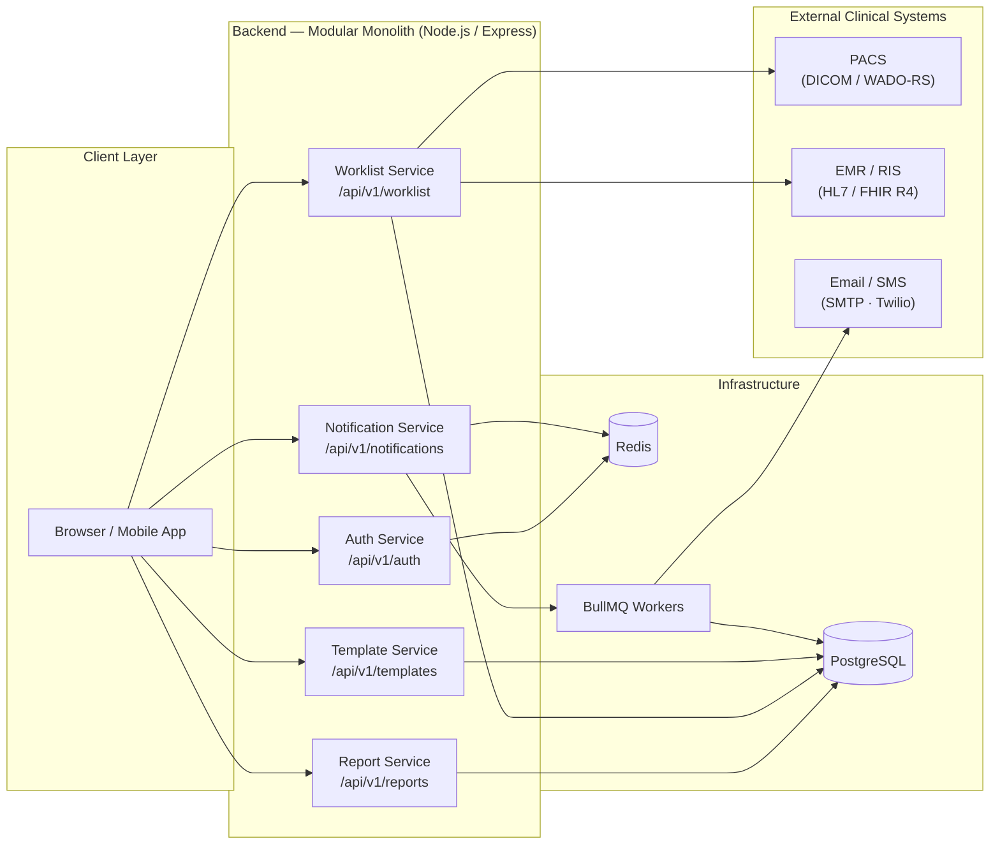

The Mosaic Reporting backend powers every action you take in the platform — from authenticating your session to routing a study to the right radiologist and generating a finalized PDF report. It is a Node.js/TypeScript REST API server designed for reliability, clear module boundaries, and straightforward integration with clinical systems such as PACS, EMR, and RIS.

<Note>
  The backend repository is maintained separately from the frontend repository. If you are looking for UI-layer documentation, see the Frontend section of these docs.
</Note>

## Service Overview Diagram

The diagram below shows the five core service modules and how they relate to the shared infrastructure layer and external clinical systems.



## Tech Stack

The backend is built on a modern, production-proven set of technologies. The table below summarizes each layer and the tool used to fill it.

| Layer | Technology | Purpose |
|---|---|---|
| Runtime | Node.js 20 | Server-side JavaScript execution environment |
| Language | TypeScript | Static typing across all backend modules |
| HTTP Framework | Express.js | Request routing, middleware, and HTTP lifecycle management |
| Primary Database | PostgreSQL | Persistent storage for reports, users, studies, and templates |
| Cache / Sessions / Queues | Redis | Session storage, response caching, and BullMQ queue backend |
| ORM | Prisma | Type-safe database access and schema migrations |
| Background Jobs | BullMQ | Async job processing (notifications, DICOM fetch, PDF generation) |
| Authentication | JWT | Stateless access tokens with Redis-backed refresh token store |

## Service Architecture

The backend is structured as a **modular monolith**: a single deployable service where each functional area is organized into its own self-contained module. This gives you the operational simplicity of a single process while maintaining clean boundaries that make the codebase easy to navigate and extend.

All modules expose their functionality through the shared REST API, mounted under the base path `/api/v1/`. Every response from every endpoint follows the same JSON envelope structure, so you always know what shape to expect:

```json
{
  "success": true,
  "data": { ... },
  "error": null,
  "meta": {
    "requestId": "req_01hxyz",
    "timestamp": "2024-06-01T12:00:00.000Z"
  }
}
```

When a request fails, `success` is `false`, `data` is `null`, and `error` contains a machine-readable code alongside a human-readable message. The `meta` field is always present and includes request tracing information.

## Modules at a Glance

The monolith is divided into five core service modules. Each module owns its own routes, controllers, services, and repository layer.

| Module | Base Route | Responsibility |
|---|---|---|
| **Auth Service** | `/api/v1/auth` | Login, logout, token issuance, and token refresh |
| **Report Service** | `/api/v1/reports` | Report CRUD, workflow state transitions, and version history |
| **Worklist Service** | `/api/v1/worklist` | Study queue management, radiologist assignment, and filtering |
| **Template Service** | `/api/v1/templates` | Template creation, editing, and versioning |
| **Notification Service** | `/api/v1/notifications` | Real-time and asynchronous notification delivery |

## External Integrations

The backend integrates with clinical systems outside the Mosaic platform:

- **DICOM / PACS** — The DICOM adapter communicates with your PACS using DIMSE (C-FIND, C-MOVE, C-STORE) for network operations and WADO-RS for image retrieval over HTTP.
- **HL7 / FHIR** — The HL7/FHIR adapter handles inbound ADT and ORM messages from your EMR/RIS and supports outbound result delivery in FHIR R4 DiagnosticReport format.

<Warning>
  External integration credentials (PACS AE titles, FHIR base URLs, and HL7 endpoint configs) are managed via environment variables and must never be committed to source control.
</Warning>

## Service Documentation

Explore the documentation for each backend service module below.

<CardGroup cols={2}>
  <Card title="Auth Service" icon="lock" href="/backend/auth-service">
    Login, logout, JWT token issuance, and session management.
  </Card>
  <Card title="Report Service" icon="file-medical" href="/backend/report-service">
    Report CRUD operations, workflow state machine, and version history.
  </Card>
  <Card title="Worklist Service" icon="list-check" href="/backend/worklist-service">
    Study queue management, radiologist assignment, and worklist filtering.
  </Card>
  <Card title="Template Service" icon="pen-ruler" href="/backend/template-service">
    Report template creation, structured fields, and template versioning.
  </Card>
  <Card title="Notification Service" icon="bell" href="/backend/notification-service">
    Real-time WebSocket notifications and async delivery via email and SMS.
  </Card>
</CardGroup>
