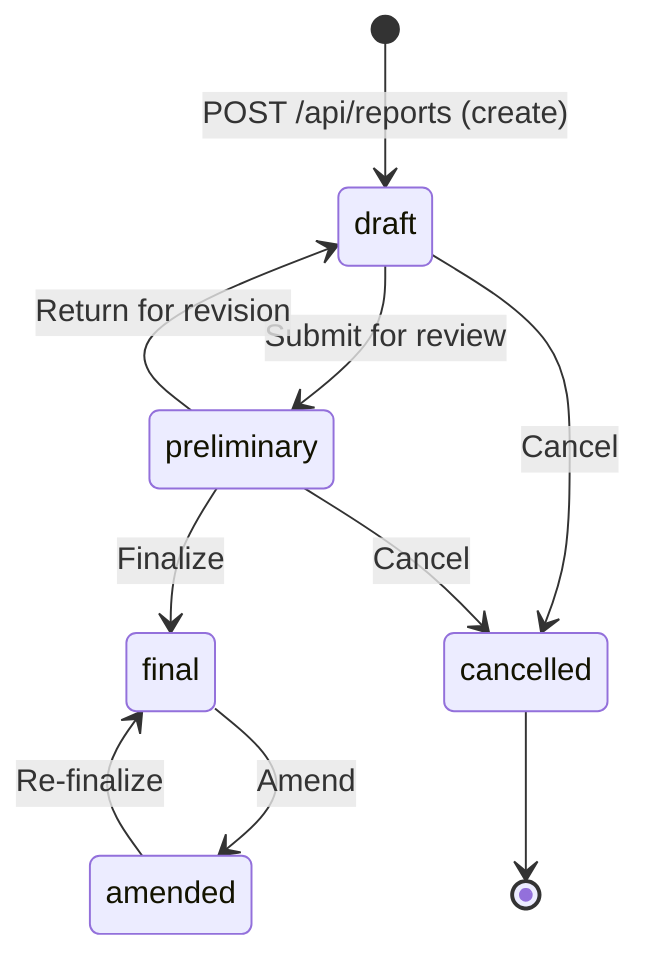

The report service is the core domain service in Mosaic Reporting. It owns all report CRUD operations, enforces the report state machine, tracks every body revision in an immutable version history, and coordinates PDF generation on finalization. All other services that need to read or modify a report must go through the report service — direct database access from other services is not permitted.

## Report States

A report moves through a defined set of states from the moment it is created until it is finalized or cancelled. The state machine is enforced in the service layer; attempting an invalid transition returns a `422 Unprocessable Entity` error with a descriptive message.



| Transition | Trigger | Allowed roles |
|---|---|---|
| `draft` → `preliminary` | Radiologist submits draft | `radiologist`, `resident` |
| `preliminary` → `final` | Attending finalizes | `radiologist`, `admin` |
| `preliminary` → `draft` | Returned for revision | `radiologist`, `admin` |
| `final` → `amended` | Amendment initiated | `radiologist`, `admin` |
| `amended` → `final` | Amendment re-finalized | `radiologist`, `admin` |
| Any → `cancelled` | Study cancelled | `admin` |

## Report Schema

Every report record in the `reports` table contains the following fields:

| Field | Type | Description |
|---|---|---|
| `id` | `uuid` | Primary key |
| `studyInstanceUID` | `varchar` | DICOM Study Instance UID from PACS |
| `patientMrn` | `varchar` | Patient medical record number |
| `templateId` | `uuid` | FK to the template version used at creation |
| `assignedTo` | `uuid` | FK to the radiologist user record |
| `status` | `enum` | Current workflow state (`draft`, `preliminary`, `final`, `amended`, `cancelled`) |
| `body` | `jsonb` | Structured report content — section/field values keyed by template field IDs |
| `createdAt` | `timestamptz` | Record creation timestamp |
| `updatedAt` | `timestamptz` | Last update timestamp |
| `finalizedAt` | `timestamptz` | Timestamp of finalization (null until finalized) |
| `finalizedBy` | `uuid` | FK to the user who finalized (null until finalized) |

## Versioning

Every `PATCH` request that modifies the `body` field triggers the creation of an immutable snapshot in the `report_versions` table before the update is applied. This gives you a complete audit trail of every edit made to a report.

```sql
-- report_versions table (simplified)
CREATE TABLE report_versions (
  id             UUID PRIMARY KEY DEFAULT gen_random_uuid(),
  report_id      UUID NOT NULL REFERENCES reports(id),
  version_number INTEGER NOT NULL,
  body_snapshot  JSONB NOT NULL,
  edited_by      UUID NOT NULL REFERENCES users(id),
  edited_at      TIMESTAMPTZ NOT NULL DEFAULT NOW()
);
```

You can retrieve the full version history for a given report via `GET /api/reports/:id/versions`. Versions are returned in descending order (newest first).

## Endpoints

| Method | Path | Description |
|---|---|---|
| GET | `/api/reports` | List reports (paginated, filterable by `status`, `assignedTo`, `studyInstanceUID`) |
| POST | `/api/reports` | Create a new report in `draft` state |
| GET | `/api/reports/:id` | Fetch a single report by ID |
| PATCH | `/api/reports/:id` | Update report body or metadata; creates a version snapshot |
| POST | `/api/reports/:id/finalize` | Transition report to `final`; enqueues PDF generation job |
| POST | `/api/reports/:id/amend` | Transition a `final` report to `amended` |
| GET | `/api/reports/:id/versions` | List all version snapshots for a report |

## Creating a Report

To create a new report, send a `POST /api/reports` request. The service validates that the referenced `studyInstanceUID` exists in the worklist and that the `templateId` points to an active template.

```json
// POST /api/reports
{
  "studyInstanceUID": "1.2.840.10008.5.1.4.1.1.2",
  "patientMrn": "MRN-00123456",
  "templateId": "tmpl_01HX9QZABC",
  "assignedTo": "usr_01HX..."
}
```

The service responds with the newly created report in `draft` state, including the pinned template version that will be used for the report's entire lifecycle.

## Editing a Report Body

Use `PATCH /api/reports/:id` to save field values. The `body` field is a free-form JSONB object keyed by template field IDs:

```json
// PATCH /api/reports/:id
{
  "body": {
    "field_findings": "No acute intracranial abnormality identified.",
    "field_impression": "Normal non-contrast CT head.",
    "field_technique": "Axial CT images of the brain without contrast."
  }
}
```

The service records a version snapshot of the pre-update body, then writes the new values. The response includes the current `version_number`.

## Finalization and PDF Generation

When you call `POST /api/reports/:id/finalize`, the service performs the following steps:

1. Validates the transition from `preliminary` → `final`.
2. Sets `finalizedAt` and `finalizedBy` on the report record.
3. Enqueues a `pdf:generate` BullMQ job with the report ID.

<Note>
  PDF generation is **asynchronous**. The finalize endpoint returns immediately with the updated report record — it does not wait for the PDF to be produced. The BullMQ worker picks up the job, renders the report HTML via Puppeteer (headless Chromium), uploads the resulting PDF to object storage (S3-compatible), and stores the object URL on the report. The notification service then emits a `report:pdf_ready` WebSocket event to the assigned radiologist once the PDF is available.
</Note>

```typescript
// Simplified BullMQ job payload
await pdfQueue.add('pdf:generate', {
  reportId: report.id,
  templateId: report.templateId,
  finalizedBy: currentUser.id,
});
```

## Error Handling

| HTTP Status | Scenario |
|---|---|
| `400 Bad Request` | Missing required fields on create |
| `403 Forbidden` | Caller's role is not permitted for the requested operation |
| `404 Not Found` | Report ID does not exist |
| `409 Conflict` | Concurrent edit conflict on PATCH |
| `422 Unprocessable Entity` | Invalid state transition attempted |
