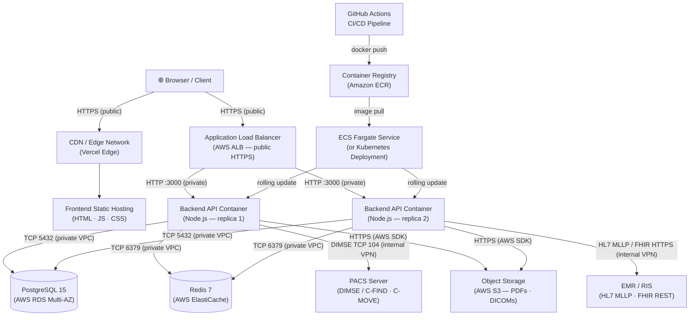

Mosaic Reporting's production environment is organized around three network zones: a public edge layer that serves the frontend SPA, a semi-public ingress layer (the Application Load Balancer) that accepts HTTPS traffic from the internet and routes it to the API, and a private VPC subnet where the backend containers, database, cache, and internal integrations live. No component in the private subnet is directly reachable from the internet.

## Production Topology Diagram

## Component Descriptions

### CDN / Edge Network
Vercel's global edge network (or an equivalent CDN such as CloudFront) caches and serves the compiled frontend assets — HTML, JavaScript bundles, CSS, and images. Requests for the SPA never reach the backend; the CDN handles all asset delivery with appropriate `Cache-Control` headers.

### Application Load Balancer (ALB)
The ALB is the only publicly internet-facing entry point to the backend. It terminates TLS (HTTPS on port 443), forwards requests as plain HTTP to the backend containers on port 3000, and performs health checks against `GET /health`. SSL certificates are managed by AWS Certificate Manager (ACM).

### Backend API Containers
The Node.js API runs as multiple container replicas (minimum two in production) within AWS ECS Fargate or a Kubernetes deployment. Each container is stateless — session state lives in Redis, not in container memory — allowing the load balancer to route any request to any replica.

### PostgreSQL (RDS Multi-AZ)
The primary relational store. In production, RDS operates in Multi-AZ mode: AWS maintains a synchronous standby replica in a second Availability Zone and automatically fails over within 60–120 seconds if the primary becomes unavailable. All backend containers connect through PgBouncer for connection pooling.

### Redis (ElastiCache)
Used for JWT access-token caching, refresh-token storage, BullMQ job queues, and worklist result caching. In production, ElastiCache runs in cluster mode across multiple shards. In staging it runs as a single node.

### PACS (Internal Network)
The Picture Archiving and Communication System is connected over an internal VPN or AWS Direct Connect link. The backend communicates with PACS using DIMSE (C-FIND for querying, C-MOVE for retrieving DICOM studies). This traffic never traverses the public internet.

### EMR / RIS (Internal Network)
Electronic Medical Records and Radiology Information Systems are reached over the same internal network. The backend sends HL7 v2 messages over MLLP for order updates and receives patient demographics, and makes FHIR REST calls for resource lookups.

### Object Storage (S3)
Finalized radiology reports are rendered to PDF and stored in an S3-compatible bucket. The backend uses the AWS SDK to upload and generate pre-signed download URLs. DICOM secondary-capture images may also be stored here.

### Container Registry (ECR)
Every successful CI build pushes a new Docker image tagged with the Git commit SHA to Amazon ECR. ECS task definitions and Kubernetes manifests reference the full image URI including the tag to guarantee reproducible deployments.

### GitHub Actions → ECS/K8s
The CI/CD pipeline builds the Docker image, pushes it to ECR, runs database migrations as a one-off task, and then updates the ECS service (or applies a new Kubernetes manifest) with the new image tag. ECS performs a rolling replacement of containers to achieve zero-downtime deployments.

## Network Security

- **Frontend** is served entirely over public HTTPS via the CDN. No origin server ports are exposed.
- **ALB** accepts inbound HTTPS (443) from the internet and is the only public entry point to the backend. Security groups deny all direct inbound traffic to the ECS tasks.
- **Backend containers, RDS, and ElastiCache** reside in private VPC subnets with no inbound rules from the internet. They communicate only within the VPC or via PrivateLink.
- **PACS and EMR** are reachable only through the internal VPN or AWS Direct Connect tunnel. No PACS or EMR port is exposed to the public internet.

## Request Path: Browser to Database

<Steps>
  <Step title="DNS Resolution">
    The browser resolves `mosaic.yourorg.com` to the Vercel edge network IP (or your CDN). For API calls, `api.mosaic.yourorg.com` resolves to the ALB's public IP address.
  </Step>
  <Step title="TLS Termination at ALB">
    The ALB accepts the HTTPS connection, terminates TLS using an ACM-managed certificate, and forwards the request as HTTP to a healthy backend container on port 3000.
  </Step>
  <Step title="Authentication Middleware">
    The backend checks the `Authorization: Bearer <token>` header, validates the JWT signature, and looks up the token in Redis to confirm it has not been revoked.
  </Step>
  <Step title="Business Logic and Query">
    The route handler executes the relevant business logic (e.g., fetching a report list) and issues a parameterized SQL query via the Prisma ORM.
  </Step>
  <Step title="PgBouncer Connection Pool">
    Prisma connects to PgBouncer (running on port 5432 locally or as a sidecar), which maintains a pool of real PostgreSQL connections to RDS, avoiding per-request connection overhead.
  </Step>
  <Step title="RDS Query Execution">
    PostgreSQL executes the query and returns the result set to PgBouncer, which forwards it back through Prisma to the route handler.
  </Step>
  <Step title="JSON Response">
    The API serializes the result as JSON, sets appropriate response headers, and the ALB forwards the response back to the browser over the established HTTPS connection.
  </Step>
</Steps>

## Horizontal Scaling

The backend is designed to scale horizontally. ECS service auto-scaling triggers additional container launches when average CPU exceeds 70% or memory exceeds 80% for 2 consecutive minutes. Kubernetes HPA can be configured with equivalent thresholds. Because all shared state lives in Redis and RDS — not in individual containers — adding replicas requires no application changes.
