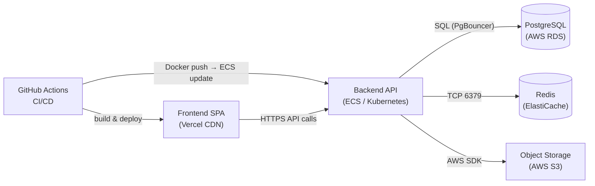

Mosaic Reporting runs as two independently deployed services — a static single-page application (SPA) for the frontend and a Node.js REST API for the backend. Each service follows its own build and release pipeline, yet they share a common GitHub Actions–driven CI/CD system, a managed PostgreSQL database, and a Redis cache layer. Understanding the overall topology is the starting point for safely operating, scaling, or troubleshooting the platform.

## High-Level Deployment Overview

The diagram below shows how the five core services relate to one another across the deployment pipeline and at runtime.

## Service Overview

| Service | Technology | Hosting |
|---------|-----------|---------|
| Frontend | Vite SPA (HTML / JS / CSS) | Vercel (or equivalent CDN/edge platform) |
| Backend API | Node.js (TypeScript) | Docker on AWS ECS Fargate or Kubernetes |
| Database | PostgreSQL 15 | AWS RDS (managed, Multi-AZ in production) |
| Cache / Queue | Redis 7 | AWS ElastiCache (managed) |
| Object Storage | S3-compatible | AWS S3 (PDF and DICOM object storage) |

## Environments

Mosaic Reporting maintains three environments that progress from local iteration to live clinical use.

| Environment | Frontend URL | Backend URL | Database | Purpose |
|-------------|-------------|-------------|----------|---------|
| `development` | `http://localhost:5173` | `http://localhost:3000` | Local Docker PostgreSQL | Day-to-day feature development and debugging |
| `staging` | `https://staging.mosaic.internal` | `https://api.staging.mosaic.internal` | RDS `db.t3.medium` | Pre-production QA and integration testing |
| `production` | `https://mosaic.yourorg.com` | `https://api.mosaic.yourorg.com` | RDS `db.r6g.large` Multi-AZ | Live clinical reporting with real patient data |

## Deployment Model

**Frontend** deploys automatically on every merge to the `main` branch. Vercel (or your equivalent static hosting platform) pulls the latest build artifact from the GitHub Actions pipeline and pushes it to all edge nodes globally. No server restart is required.

**Backend** deploys as a Docker image pushed to Amazon ECR (Elastic Container Registry). A new ECS service update (or Kubernetes rolling deployment) replaces running containers with the new image with zero downtime. Database migrations run as a one-off pre-deployment task before the service update begins.

**Secrets** are never stored in source code or Docker images. All runtime secrets — database URLs, JWT keys, third-party credentials — are stored in AWS Secrets Manager (or HashiCorp Vault) and injected into containers at startup.

## Key Infrastructure Components

- **GitHub Actions** — CI/CD pipelines for both the frontend and backend; handles linting, testing, building, and deploying across all environments.
- **Amazon ECR** — Docker image registry; each image is tagged with the Git commit SHA for traceability.
- **AWS ALB** — Application Load Balancer in front of the backend ECS tasks; handles HTTPS termination and routes traffic to healthy containers.
- **PgBouncer** — Connection pooler (deployed as a sidecar) that proxies all backend connections to RDS, preventing connection exhaustion under load.
- **BullMQ on Redis** — Job queue for asynchronous workloads (report finalization, HL7 message dispatch, DICOM prefetch).

## Explore the Deployment Docs

<CardGroup cols={2}>
  <Card title="Architecture" icon="diagram-project" href="/deployments/architecture">
    Full infrastructure diagram and network topology for the production environment.
  </Card>
  <Card title="Frontend Hosting" icon="browser" href="/deployments/frontend-hosting">
    How the Vite SPA is built, hosted on Vercel, and served via CDN.
  </Card>
  <Card title="Backend Hosting" icon="server" href="/deployments/backend-hosting">
    Docker containerization and ECS/Kubernetes deployment for the API.
  </Card>
  <Card title="Database Infra" icon="database" href="/deployments/database-infra">
    RDS PostgreSQL and ElastiCache Redis configuration and connection pooling.
  </Card>
  <Card title="Frontend CI/CD" icon="code-branch" href="/deployments/frontend-ci-cd">
    GitHub Actions pipeline for the frontend: lint, test, build, deploy.
  </Card>
  <Card title="Backend CI/CD" icon="code-branch" href="/deployments/backend-ci-cd">
    GitHub Actions pipeline for the backend: test, Docker build, ECR push, ECS deploy.
  </Card>
  <Card title="Monitoring" icon="chart-line" href="/deployments/monitoring">
    Logging, metrics, tracing, and alerting for production observability.
  </Card>
  <Card title="Secrets & Config" icon="lock" href="/deployments/secrets-config">
    Managing secrets and environment-specific configuration safely.
  </Card>
  <Card title="Environments" icon="layer-group" href="/deployments/environments">
    Topology and data policies for dev, staging, and production.
  </Card>
  <Card title="CDN Config" icon="globe" href="/deployments/cdn-config">
    Cache-control headers, invalidation strategy, and security headers.
  </Card>
</CardGroup>
