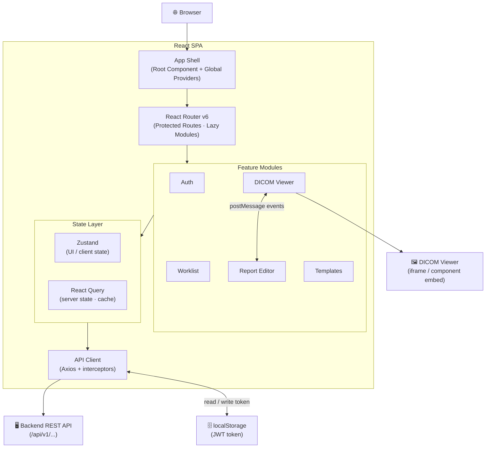
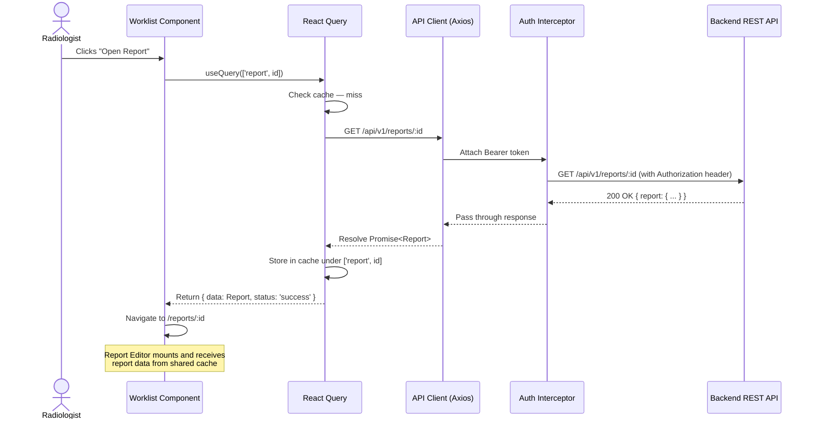

The Mosaic Reporting frontend is organised as a layered architecture where each layer has a single, well-defined responsibility. The outermost layer is the App Shell — a root React component that boots the application, provisions global providers, and hands off to React Router. The router resolves the current URL to a feature module, which renders UI components backed by a shared state layer. That state layer talks to a typed API client, which in turn communicates with the backend over HTTPS. The sections below describe each layer in detail and show how data moves through the stack during a typical interaction.

## Architecture Overview

The diagram below shows the full component hierarchy from the browser down to the backend REST API, including the two external integration points: the DICOM viewer and browser `localStorage`.

## Layer Descriptions

### 1. App Shell

The App Shell is the single root React component (`<App />`) that is mounted into the HTML entry point by Vite. It is responsible for bootstrapping all global providers before any feature UI is rendered:

- **`QueryClientProvider`** — configures and injects the React Query client with global defaults for stale time, retry policy, and error handling.
- **`AuthProvider`** — wraps the application in an auth context that exposes the current user, their role claims, and the `logout` helper to every descendant component.
- **`RouterProvider`** — mounts the React Router instance and begins listening for URL changes.
- **`ToastProvider`** — supplies the global notification surface used by feature modules to report success and error feedback.

Nothing in the Shell performs data fetching or renders domain UI. Its sole purpose is to guarantee that all downstream components have access to the shared infrastructure they need.

### 2. Router Layer

React Router v6 drives all client-side navigation. The routing configuration is defined in a single `routes.tsx` file at the project root and uses the `createBrowserRouter` API. Key characteristics of the routing layer:

- **Protected routes** — a `<RequireAuth>` wrapper component checks for a valid session before rendering any feature module. Unauthenticated users are redirected to `/login` with the intended destination preserved as a `redirect` query parameter.
- **Role-based guards** — a `<RequireRole>` component accepts an array of permitted roles and renders a `403` page for users whose claims do not match.
- **Lazy loading** — every feature module is imported via `React.lazy()` and wrapped in `<Suspense>`, so Vite code-splits each feature into its own chunk. The Worklist, Report Editor, Templates, and DICOM Viewer modules are never loaded until the user first navigates to them.

### 3. Feature Modules

Each feature is a self-contained folder under `src/features/` that owns its own components, hooks, types, and local utilities. Modules do not import from each other directly; cross-feature communication happens through the shared state layer or via URL navigation. The five primary feature modules are:

| Module | Folder | Primary Responsibility |
|---|---|---|
| Auth | `src/features/auth/` | Login form, token management UI, session expiry handling |
| Worklist | `src/features/worklist/` | Study list, filters, status badges, assignment controls |
| Report Editor | `src/features/reports/` | Structured editor, macro toolbar, sign-off workflow |
| Templates | `src/features/templates/` | Template CRUD, template picker, modality tagging |
| DICOM Viewer | `src/features/viewer/` | Viewer shell, postMessage bridge, layout manager |

### 4. State Layer

The state layer is split cleanly between two tools with non-overlapping concerns:

**Zustand** manages ephemeral client-side state that has no server representation — things like which worklist panel is expanded, whether the editor toolbar is pinned, and the current layout mode of the viewer. Zustand stores are defined per-feature to keep them scoped and easy to reset on navigation.

**React Query** manages everything that comes from the server: studies, reports, templates, and user preferences. React Query's cache acts as the frontend's in-memory database; components subscribe to queries by key and re-render automatically when the underlying data changes. Mutations use the `onMutate` / `onError` / `onSettled` lifecycle to implement optimistic updates for latency-sensitive actions such as updating a study status on the worklist.

### 5. API Client

The API client (`src/lib/apiClient.ts`) wraps Axios with two request interceptors and one response interceptor:

- **Auth request interceptor** — reads the JWT from `localStorage` and appends `Authorization: Bearer <token>` to every outgoing request header.
- **Content-type request interceptor** — sets `Content-Type: application/json` and `Accept: application/json` on all non-multipart requests.
- **401 response interceptor** — on receiving a `401`, the interceptor pauses the failed request, attempts a silent token refresh against `/api/v1/auth/refresh`, stores the new token, and replays the original request. If the refresh itself fails, the user is logged out and redirected to `/login`.

All API functions are typed end-to-end: request payloads and response shapes are defined as TypeScript interfaces in `src/types/api.ts`, and the API client functions return `Promise<T>` with those interfaces as type parameters.

## Data Flow: Step-by-Step

The sequence below traces a complete round-trip from a user action to a UI update.

<Steps>
  <Step title="User triggers an action">
    The radiologist clicks **Open Report** on a worklist row. The Worklist feature component calls a React Query `useQuery` hook with the key `['report', reportId]`.
  </Step>
  <Step title="React Query checks the cache">
    React Query looks up `['report', reportId]` in its in-memory cache. If valid cached data exists and is within the configured stale time, it is returned immediately and the UI renders without a network request.
  </Step>
  <Step title="API Client dispatches the request">
    On a cache miss (or when the data is stale), React Query invokes the query function, which calls `apiClient.get<Report>('/api/v1/reports/:id')`. The auth interceptor attaches the Bearer token before the request leaves the browser.
  </Step>
  <Step title="Backend processes the request">
    The backend authenticates the token, authorises the requesting user against the report's assigned radiologist, retrieves the report from the database, and returns a JSON response.
  </Step>
  <Step title="Response is cached and state is updated">
    Axios resolves the promise; React Query stores the response payload in the cache under the `['report', reportId]` key. All components subscribed to that query key re-render with the fresh data.
  </Step>
  <Step title="UI renders the updated view">
    The Report Editor feature module receives the report data as a typed prop from the query hook, populates the editor with the report content, and enables the editing toolbar. The radiologist can now begin dictating or typing.
  </Step>
</Steps>

## Typical Report-Fetch Sequence

The sequence diagram below shows the same flow with the specific actors and messages involved.

## Integration Points

The frontend integrates with three external systems beyond its own codebase:

| Integration | Mechanism | Details |
|---|---|---|
| Backend REST API | HTTPS / JSON | All domain data (studies, reports, templates, users) is read from and written to `/api/v1/…` endpoints via the Axios client described above. |
| DICOM Viewer | iframe embed + `postMessage` | The viewer is rendered inside a sandboxed `<iframe>`. The Report Editor sends structured messages (e.g., `{ type: 'LOAD_STUDY', studyUid }`) and listens for annotation events (`{ type: 'ANNOTATION_ADDED', payload }`) using the `window.postMessage` / `window.addEventListener('message', …)` browser API. |
| Browser `localStorage` | Direct read/write | The access token and refresh token are persisted in `localStorage` under the keys `mosaic_access_token` and `mosaic_refresh_token`. The API client reads these on every request; the auth module writes them on login and clears them on logout. |
