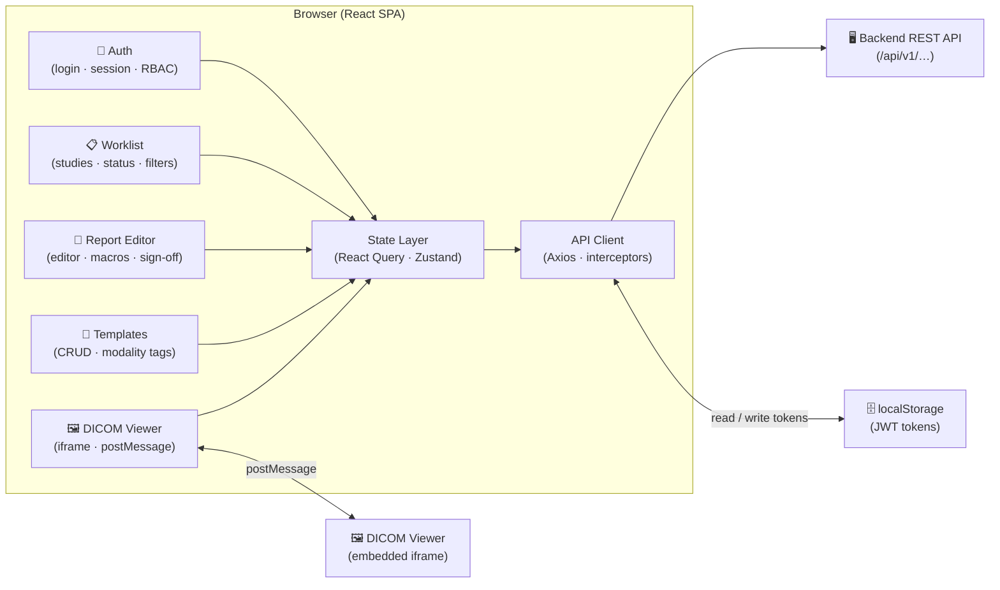

The Mosaic Reporting frontend is a React single-page application (SPA) that provides radiologists, residents, and technologists with a unified, browser-based workspace for every stage of the reporting workflow. From reviewing a worklist and authoring structured reports to managing templates and launching the integrated DICOM viewer, the entire experience is delivered through one cohesive interface — no page reloads, no context switches, and no installed software required beyond a modern web browser.

<Note>
  The frontend lives in its own repository, separate from the backend services repo. All cross-team changes that touch the API contract must be coordinated across both repositories. See the backend API documentation for endpoint specifications and versioning policy.
</Note>

## Tech Stack

The table below summarises every major library or tool in the frontend and the role it plays.

| Technology | Version | Role |
|---|---|---|
| React | 18 | Core UI rendering and component model |
| TypeScript | 5 | Static typing across the entire codebase |
| Vite | 5 | Development server, HMR, and production bundling |
| React Query (TanStack Query) | 5 | Server-state fetching, caching, and synchronisation |
| Zustand | 4 | Lightweight client-side UI state management |
| React Router | 6 | Declarative client-side routing and protected routes |
| Tailwind CSS | 3 | Utility-first styling system |
| Axios | 1 | HTTP client with interceptor support |

## Who Uses the Frontend

Mosaic Reporting is designed for three primary user roles, each with a distinct workflow:

- **Radiologists** — draft, edit, finalize, and sign reports; access the DICOM viewer inline; manage personal report templates.
- **Residents** — author preliminary reports that are routed to an attending radiologist for review and co-signature.
- **Technologists** — manage the worklist, update study statuses, attach prior study references, and flag studies that require urgent attention.

Role-based access control is enforced on the frontend through protected routes and permission-aware UI components, backed by claims in the JWT issued by the authentication service.

## Key Responsibilities

The frontend owns the following end-to-end user experiences:

1. **Report Authoring** — A rich, structured editor that supports free-text dictation, structured data entry, macro insertion, and voice-recognition integration.
2. **Worklist Management** — A filterable, sortable table of studies assigned to the current user or group, with real-time status updates via polling.
3. **DICOM Viewer Integration** — Embedded display of imaging studies alongside the report editor, enabling radiologists to annotate and report without leaving the page.
4. **Template Management** — A library of reusable report templates that can be created, edited, shared, and applied to new reports.
5. **User Authentication** — Login, logout, token refresh, and session expiry handling, all orchestrated through the auth subsystem.

## Communicating with the Backend

The SPA communicates exclusively with the Mosaic Reporting backend through a versioned REST API (`/api/v1/…`). There is no direct database access from the browser. All requests are made via an Axios-based API client that:

- Attaches the current Bearer token from `localStorage` to every outgoing request via a request interceptor.
- Intercepts `401 Unauthorized` responses to trigger a silent token refresh before retrying the original request.
- Translates API error shapes into typed `AppError` objects that feature components can render consistently.

React Query sits above the API client and manages caching, background refetching, optimistic updates, and loading/error state — keeping UI components free of boilerplate data-fetching logic.

## Major Subsystems

The diagram below shows how the five feature modules relate to each other and to the shared infrastructure layers at a glance.

Each area of the application is documented in its own page. Use the cards below to navigate to the subsystem you need.

<CardGroup cols={2}>
  <Card
    title="Authentication"
    icon="lock"
    href="/frontend/auth"
  >
    JWT-based login flow, token refresh strategy, protected routes, and role-based access control on the frontend.
  </Card>
  <Card
    title="Report Editor"
    icon="file-pen"
    href="/frontend/report-editor"
  >
    The structured report authoring environment: editor architecture, macro support, voice integration, and sign-off flow.
  </Card>
  <Card
    title="Worklist"
    icon="list-check"
    href="/frontend/worklist"
  >
    Study worklist management: filtering, sorting, status transitions, real-time updates, and assignment logic.
  </Card>
  <Card
    title="DICOM Viewer Integration"
    icon="image"
    href="/frontend/viewer-integration"
  >
    How the frontend embeds and communicates with the DICOM viewer, including postMessage events and layout coordination.
  </Card>
  <Card
    title="Template Management"
    icon="copy"
    href="/frontend/templates"
  >
    Creating, editing, sharing, and applying report templates across modalities and subspecialties.
  </Card>
</CardGroup>
