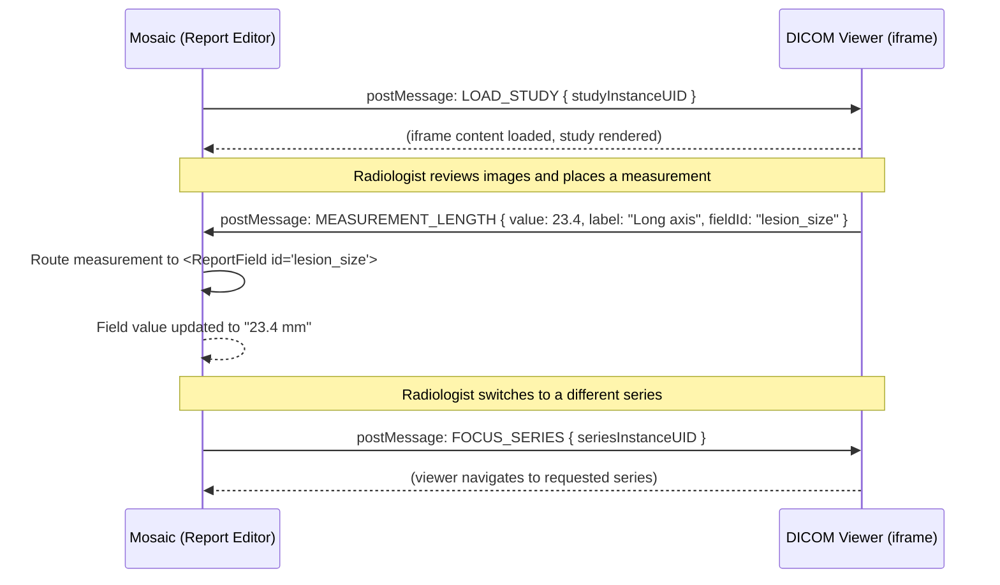

Mosaic Reporting embeds an external DICOM viewer — OHIF Viewer or a compatible alternative — in a resizable split-pane layout directly alongside the report editor. This lets you review images and author the report simultaneously without switching between applications. Measurements made in the viewer can be inserted into report fields automatically through a structured postMessage interface.

## Layout

The split-pane layout is rendered by `<DicomViewerPane>` on the left and the report editor on the right. The default split is **60% viewer / 40% editor**, but you can drag the divider to any ratio. The preference is persisted to `localStorage` and restored on next open.

```text
┌─────────────────────────────┬──────────────────────┐
│                             │                      │
│      DICOM Viewer           │   Report Editor      │
│      (OHIF iframe)          │   (ReportForm)       │
│         60%                 │       40%            │
│                             │                      │
└─────────────────────────────┴──────────────────────┘
                  ↕ draggable divider
```

## Integration Method

The viewer runs inside an `<iframe>` managed by `<DicomViewerPane>`. Because the viewer and the Mosaic app are served from different origins, all communication between the two frames uses the `window.postMessage` API.

<Warning>
  **CORS and `Content-Security-Policy` must be configured before the viewer will load.** The iframe `src` origin must be explicitly added to Mosaic's `frame-src` CSP directive, and the viewer application must include an `Access-Control-Allow-Origin` header permitting the Mosaic origin. Without this, the browser will block the iframe from loading. Set the allowed origins in your environment variables — never hardcode them.
</Warning>

## Environment Variables

| Variable | Description | Example |
|---|---|---|
| `VITE_DICOM_VIEWER_URL` | Base URL of the DICOM viewer application | `https://viewer.internal.example.com` |
| `VITE_DICOM_VIEWER_ALLOWED_ORIGIN` | Origin checked in `postMessage` event listeners | `https://viewer.internal.example.com` |

## Study Loading

When the report editor opens a study, it passes the `studyInstanceUID` to the viewer via `postMessage`. The viewer loads the corresponding DICOM series automatically.

```ts
// Sending the load command to the viewer iframe
viewerIframe.contentWindow?.postMessage(
  {
    type: "LOAD_STUDY",
    studyInstanceUID: study.studyInstanceUID,
  },
  import.meta.env.VITE_DICOM_VIEWER_ALLOWED_ORIGIN
);
```

## postMessage Communication Interface

The following message types are exchanged between Mosaic and the viewer iframe:

```ts
// src/features/viewer/types/ViewerMessages.ts

// ── Messages sent FROM Mosaic TO the viewer ──────────────────────────────────

/** Tell the viewer to load a specific study */
interface LoadStudyMessage {
  type: "LOAD_STUDY";
  studyInstanceUID: string;
}

/** Tell the viewer to highlight a specific series */
interface FocusSeriesMessage {
  type: "FOCUS_SERIES";
  seriesInstanceUID: string;
}

// ── Messages received FROM the viewer IN Mosaic ───────────────────────────────

/** Viewer reports a length measurement the user placed */
interface MeasurementLengthMessage {
  type: "MEASUREMENT_LENGTH";
  value: number;    // millimetres
  label: string;    // e.g. "Long axis"
  fieldId?: string; // optional target field ID in the report template
}

/** Viewer reports an area measurement */
interface MeasurementAreaMessage {
  type: "MEASUREMENT_AREA";
  value: number;    // mm²
  label: string;
  fieldId?: string;
}

/** Viewer reports a Hounsfield Unit attenuation measurement */
interface MeasurementHUMessage {
  type: "MEASUREMENT_HU";
  value: number;    // HU
  label: string;
  fieldId?: string;
}

export type InboundViewerMessage =
  | MeasurementLengthMessage
  | MeasurementAreaMessage
  | MeasurementHUMessage;
```

## The `<DicomViewerPane>` Component

`<DicomViewerPane>` is responsible for mounting the iframe, sending the initial `LOAD_STUDY` message once the frame reports it is ready, and registering the `message` event listener that routes inbound measurement events to the correct report fields.

```tsx
// src/features/viewer/DicomViewerPane.tsx
import { useEffect, useRef } from "react";
import { InboundViewerMessage } from "./types/ViewerMessages";

interface DicomViewerPaneProps {
  studyInstanceUID: string;
  onMeasurement: (msg: InboundViewerMessage) => void;
}

export function DicomViewerPane({
  studyInstanceUID,
  onMeasurement,
}: DicomViewerPaneProps) {
  const iframeRef = useRef<HTMLIFrameElement>(null);
  const allowedOrigin = import.meta.env.VITE_DICOM_VIEWER_ALLOWED_ORIGIN;
  const viewerUrl = import.meta.env.VITE_DICOM_VIEWER_URL;

  useEffect(() => {
    function handleMessage(event: MessageEvent) {
      // Always validate the origin before trusting the message
      if (event.origin !== allowedOrigin) return;

      const msg = event.data as InboundViewerMessage;

      if (
        msg.type === "MEASUREMENT_LENGTH" ||
        msg.type === "MEASUREMENT_AREA" ||
        msg.type === "MEASUREMENT_HU"
      ) {
        onMeasurement(msg);
      }
    }

    window.addEventListener("message", handleMessage);
    return () => window.removeEventListener("message", handleMessage);
  }, [allowedOrigin, onMeasurement]);

  function handleIframeLoad() {
    // Once the iframe has loaded, send the study UID
    iframeRef.current?.contentWindow?.postMessage(
      { type: "LOAD_STUDY", studyInstanceUID },
      allowedOrigin
    );
  }

  return (
    <iframe
      ref={iframeRef}
      src={viewerUrl}
      onLoad={handleIframeLoad}
      title="DICOM Viewer"
      style={{ width: "100%", height: "100%", border: "none" }}
      sandbox="allow-scripts allow-same-origin allow-forms"
    />
  );
}
```

## Message Flow Diagram

The following diagram shows the full sequence of communication between Mosaic and the DICOM viewer during a typical reporting session:



## Annotation Sync

When the viewer dispatches a `MEASUREMENT_*` message with a `fieldId`, Mosaic automatically inserts the formatted value (including units) into the matching report field. If no `fieldId` is provided, the measurement appears in a floating **Measurements Tray** panel from which you can drag-and-drop values into any field.
